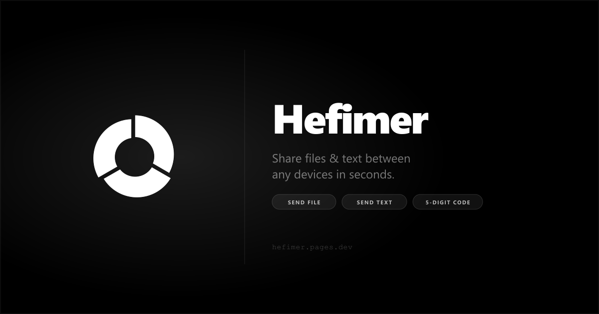
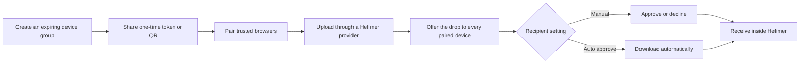
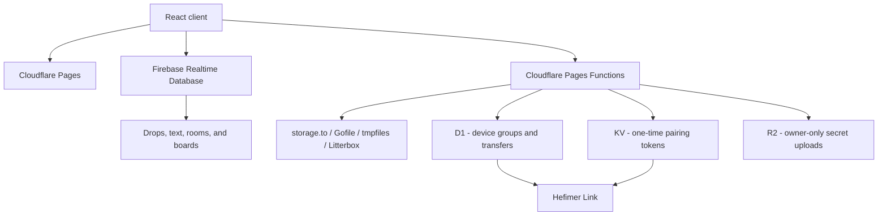

<div align="center">
  

  <h1>Hefimer</h1>

  <p><strong>Send once. Receive anywhere. Let it disappear.</strong></p>
  <p>A temporary sharing workspace for files, text, live rooms, collaborative boards, and trusted devices.</p>

  <p>
    <a href="https://hefimer.qzz.io"></a>
    <a href="https://github.com/dev-hkm/hefimer"></a>
  </p>

  <p>
    
    
  </p>

  <br />
  
</div>

## The idea

Hefimer is built for the small gap between "I have this on one device" and "I need it on another one now."

There is no inbox to organize and no permanent drive to maintain. A sender creates a temporary drop, receives a five-digit code, and shares that code with the recipient. The content remains available only for its selected lifetime.

Hefimer expands that simple interaction into one connected workspace:

| Moment | What Hefimer does |
| --- | --- |
| **Send a file** | Uploads through a selected temporary provider and returns a short retrieval code. |
| **Send text** | Shares plain text or syntax-highlighted snippets without creating a file first. |
| **Receive** | Opens a file or text drop from the same page using its five-digit code. |
| **Meet temporarily** | Creates expiring chat rooms for lightweight, disposable conversations. |
| **Think together** | Creates live collaborative boards for short-lived visual sessions. |
| **Link devices** | Pairs trusted browsers once, then offers future drops directly to the group. |

> Hefimer is not trying to become another permanent cloud drive. It is a fast lane for content that only needs to exist long enough to arrive.

## Built with OpenAI Codex

Hefimer was developed with **OpenAI Codex as the primary engineering partner**. Product direction, feature decisions, visual feedback, and real-world acceptance testing remained human-led; Codex handled the implementation work across the frontend, backend, tests, Git workflow, and Cloudflare deployment.

This was not a one-shot generated application. Codex was used throughout an iterative engineering process:

1. **Codebase recovery and auditing** - Codex inspected a long-running prototype that had moved through AI Studio and multiple development environments, mapped its real behavior, and removed obsolete integrations without breaking active flows.
2. **Production debugging** - Codex traced failures across the browser, provider APIs, Pages Functions, and persisted metadata. One example was a storage.to bug where Hefimer downloaded the provider's HTML share page instead of the file bytes; Codex reproduced it with production data, added a failing test, resolved the signed download URL, and verified the fix against the live endpoint.
3. **Hefimer Link architecture** - Codex helped reason through accountless device identity, expiring groups, one-time pairing tokens, approval states, and automatic receiving, then implemented the complete React, Pages Functions, D1, KV, cryptographic signing, QR, and polling flow.
4. **Interaction and visual design** - Codex rebuilt the landing experience with a monochrome editorial direction, animated 3D scenes, scroll-driven storytelling, reveal transitions, and responsive mobile behavior while preserving the original sharing logic.
5. **Verification and shipping** - Changes were protected with Git checkpoints, TypeScript checks, automated tests, browser smoke tests, production D1 inspection, and direct Cloudflare Pages deployments.

The collaboration model was simple: **the human defined what Hefimer should feel like and tested whether it was useful; Codex turned that direction into a working, deployed system.**

## Hefimer Link

**Hefimer Link** is the feature that turns temporary sharing into a persistent trusted-device lane without requiring user accounts.

### Pair once

One device creates a group with a lifetime of **12 hours, 24 hours, 7 days, 30 days, or no expiry**. Hefimer generates a single-use token in the form:

```text
hfm-7Kq2mN9xP4vR8sT1wY6aB3cD5eF0gH2jL4zQ
```

The token contains 36 randomized letters and numbers, expires after ten minutes, and can also be scanned as a QR code. A browser-local P-256 identity signs device API requests, so pairing does not need an email address or password.

### Send through the existing Hefimer flow

Hefimer Link does not invent a second storage system. The sender uploads through the normal Hefimer provider flow, receives a drop code, and Hefimer records a transfer offer for every other device in the group.

### Approve or receive automatically

When another paired device has Hefimer open, it sees the incoming file and can approve or decline it. A device can also enable **Auto approve**; approved files are then downloaded automatically while that device is online and the page is open.



### What is stored

- The original file stays with the selected temporary file provider.
- D1 stores device groups, memberships, transfer metadata, and recipient states.
- KV stores short-lived pairing-token lookups.
- A device's private identity remains in that browser.
- Hefimer Link stores references to drops, not duplicate file payloads.

## File delivery

Hefimer currently supports four public file-provider paths:

| Provider | Role in Hefimer |
| --- | --- |
| **storage.to** | Default provider with direct upload support and same-origin streamed downloads. |
| **Gofile** | Anonymous file hosting; retrieval opens the provider page where required. |
| **tmpfiles** | Short-lived small-file delivery. |
| **Litterbox** | Temporary Catbox-backed delivery with selectable expiry windows. |

Downloads from supported temporary providers are routed through a guarded same-origin Pages Function. This preserves the requested filename, follows provider redirects safely, and streams bytes instead of opening a blank tab or downloading an HTML landing page.

An owner-only **Secret R2 mode** is also present for private Cloudflare R2 uploads. Its credentials live in Cloudflare secrets and are never shipped to the browser or committed to this repository.

## Architecture



### Technology

| Layer | Stack |
| --- | --- |
| **Interface** | React 19, TypeScript, Tailwind CSS, Motion, Lucide |
| **Build** | Vite |
| **Edge backend** | Cloudflare Pages Functions |
| **Device persistence** | Cloudflare D1 |
| **Pairing tokens** | Cloudflare KV |
| **Realtime workspace** | Firebase Realtime Database |
| **Private object storage** | Cloudflare R2 with signed S3-compatible requests |
| **Testing** | Node test runner, TSX, Puppeteer smoke flows |
| **Deployment** | Wrangler and Cloudflare Pages |

## Run locally

### Prerequisites

- Node.js and npm
- A Cloudflare account for Pages Functions, D1, KV, and optional R2 behavior
- Wrangler authenticated with the target Cloudflare account for the full Pages runtime

### Install and start

```bash
git clone https://github.com/dev-hkm/hefimer.git
cd hefimer
npm install
npm run dev
```

For the Cloudflare Pages runtime on port `4175`:

```bash
npm run dev:pages
```

R2 values belong in `.env.local` for local server work or in Cloudflare Pages secrets for deployment. Start from `.env.example`; never commit real credentials.

## Quality checks

```bash
npm run lint
npm test
npm run build
```

The automated suite covers device request signing, provider download streaming, filename preservation, storage.to signed-link resolution, and download proxy URL integrity. A Puppeteer smoke flow exercises group creation, token pairing, auto-approval, and automatic download across two isolated browser contexts.

## Current boundaries

- Temporary provider availability and limits are controlled by each third-party service.
- Auto-approval can download automatically only while the recipient has Hefimer open.
- Gofile may require the recipient to continue on its provider page.
- Hefimer Link is intentionally accountless; clearing a browser's local site data also removes that browser's device identity.

## Live project

<div align="center">
  <h3>Try the deployed build</h3>
  <p><a href="https://hefimer.qzz.io"><strong>hefimer.qzz.io</strong></a></p>
  <p>Send a file. Share five digits. Or pair your devices once with Hefimer Link.</p>
</div>
